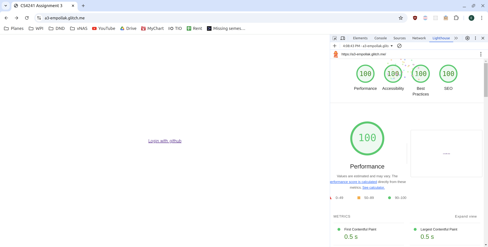
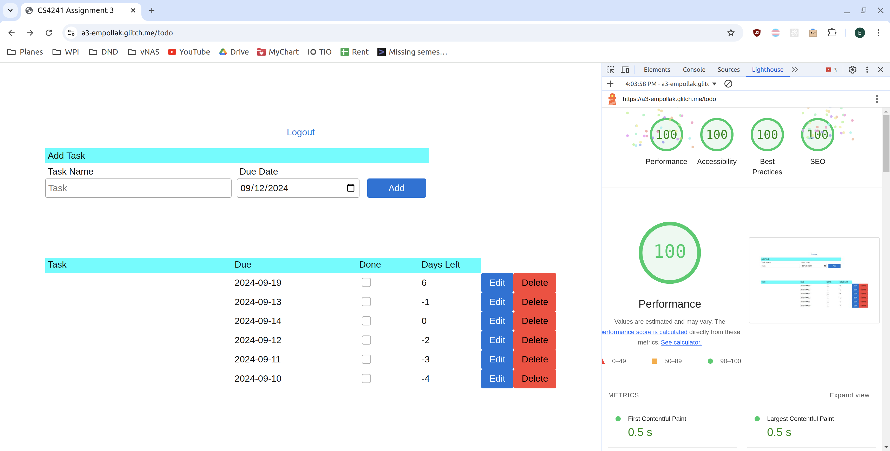

## To-Do List

http://a3-empollak.glitch.me

This project is a to-do list application. It allows users to create a to-do list and organizes it by date due.
I faced some challenges getting the layout just how I wanted it, but using the CSS grid made that much easier.
I used the GitHub authentication strategy because it meant that I did not have to store or lookup user passwords. 
Please note that a lot of the code for the authentication comes from the examples at https://www.passportjs.org/packages/passport-github2/
I used the Picnic CSS framework as it is extremely lightweight. Most of the CSS alterations that I made were just for position.
I did change the red button to have black text in order to meet the Lighthous criteria for contrast.

## Technical Achievements
- **Tech Achievement 1**: I used OAuth authentication via the GitHub strategy
- **Tech Achievement 2**: I got 100% on the lighthouse tests. See below for pictures.

### Design/Evaluation Achievements
- **Design Achievement 1**: I followed the following tips from the W3C Web Accessibility Initiative:
- Each page has an informative and unique title. It tells the user what that page is for, and has the overall website name.
- Link text is meaningful. My log in and out links are not just vague "click here."
- Provide sufficient contrast between foreground and background. As an example, the red buttons use black text for higher contrast.
- Don't use color alone to convey info. I use color on all of my buttons to show what they'll do, but they're also labelled.
- Ensure that form elements include clearly associated labels. All inputs have a label associated with them in the header.
- Associate a label with every form control. All inputs have a label tied to their ID, for screen readers. Some of these labels are hidden.
- Identify page language. All pages have a lang=en attribute.
- Reflect the reading order in the code order. Even when viewed with no CSS, the elements are layed out logically.

